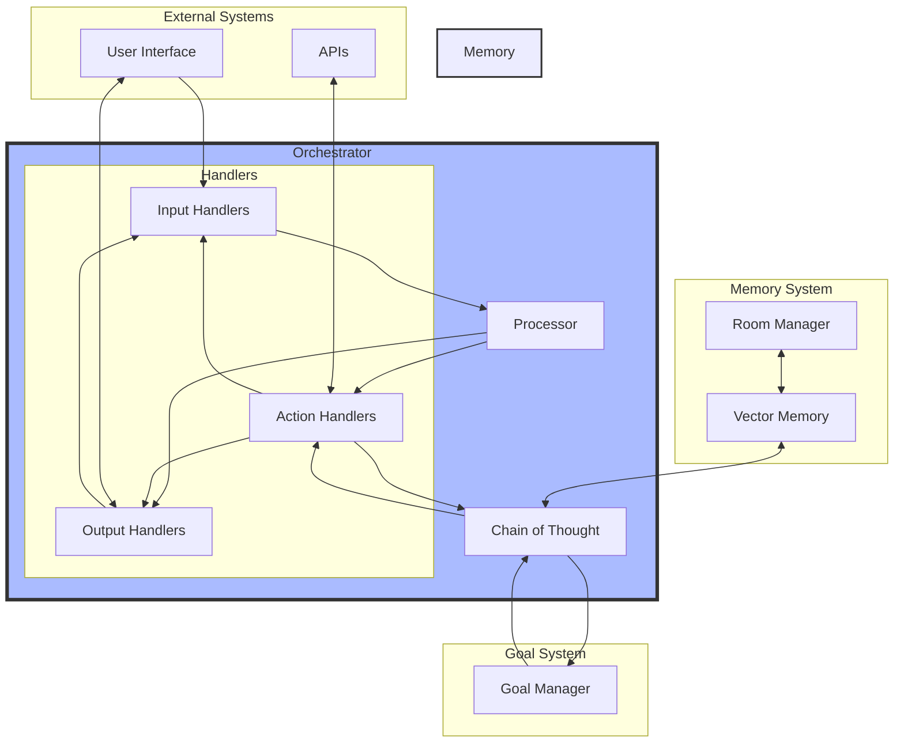

# Solana AI Multimodal Agent

The Solana AI Multimodal Agent is a powerful generative library designed for seamless on-chain execution. It is chain-agnostic, allowing users to perform tasks across multiple blockchains, including Solana, Ethereum, and Starknet. By simply injecting context, users can effortlessly interact with various on-chain applications, including games.

## Quick Start

### Requirements

- Node.js 16.0+
- pnpm
- Bun
- Docker Desktop

### Installation

1. **Install Dependencies**: 
   ```bash
   pnpm install
   ```
2. **Configure Environment Variables**: 
   ```bash
   cp .env.example .env
   ```
3. **Start Docker Services**: 
   ```bash
   ./docker.sh
   ```

Alternatively, simplify with a Makefile:

```makefile
# Makefile
install:
    pnpm install

copy-env:
    cp .env.example .env

start-docker:
    ./docker.sh
```

Run the commands using Make:

```bash
make install copy-env start-docker
```

## Examples

The project includes professional examples for various use cases:

### Basic Example

A simple CLI agent using Chain of Thought:

```bash
bun run basic
```

### Goal-Based Example

Demonstrates hierarchical goal planning and execution:

```bash
bun run goals
```

### Twitter Bot Example

A bot that autonomously monitors mentions and generates responses:

```bash
bun run twitter
```

### API Integration Example

Illustrates integration with external APIs:

```bash
bun run api
```

## Concepts Overview

**Core Concepts** include:

### Orchestrator

- **Data Flow**: Manages and routes data efficiently.
- **Task Scheduling**: Oversees recurring tasks to maintain workflow.
- **Chain of Thought**: Invokes reasoning for task execution.

### Handlers

Handlers process data and generate outputs. They are categorized as:

- **Input Handlers**: Manage incoming data (e.g., user messages).
- **Action Handlers**: Perform operations and return results (e.g., API calls).
- **Output Handlers**: Produce side effects (e.g., sending notifications).

```typescript
// Register an action handler
orchestrator.registerIOHandler({
  name: "universalApiCall",
  role: "action",
  schema: z.object({
    method: z.enum(["GET", "POST", "PUT", "PATCH", "DELETE"]),
    url: z.string().url(),
    headers: z.record(z.string()).optional(),
    body: z.union([z.string(), z.record(z.any())]).optional(),
  }),
  handler: async (payload) => {
    const response = await fetch(/* ... */);
    return response;
  },
});
```

### Goals

The agent utilizes Chain of Thought to:

- Formulate strategies for goals.
- Decompose complex objectives into actionable subgoals.
- Learn from outcomes to improve future actions.

### Monitoring Progress

Track the agent’s actions by subscribing to events:

```typescript
dreams.on("think:start", ({ query }) => {
  console.log("🧠 Thinking about:", query);
});

dreams.on("action:complete", ({ action, result }) => {
  console.log("✅ Action completed:", {
    type: action.type,
    result,
  });
});
```

### Protocol Design

The system's architecture includes:

1. **Context Layers**: Game/Application State, Historical Data, Execution Context.
2. **Chain of Thought Kernel**: Reasoning Engine, Memory Integration, Action Planning.
3. **Vector Database**: Experience Storage, Knowledge Retrieval, Similarity Search.
4. **Swarm Rooms**: Multi-Agent Collaboration and Knowledge Sharing.

### System Flow Diagram



### Key Features

- Flexible handler composition.
- Autonomous decision-making.
- Contextual memory and learning.
- Goal-oriented behavior.
